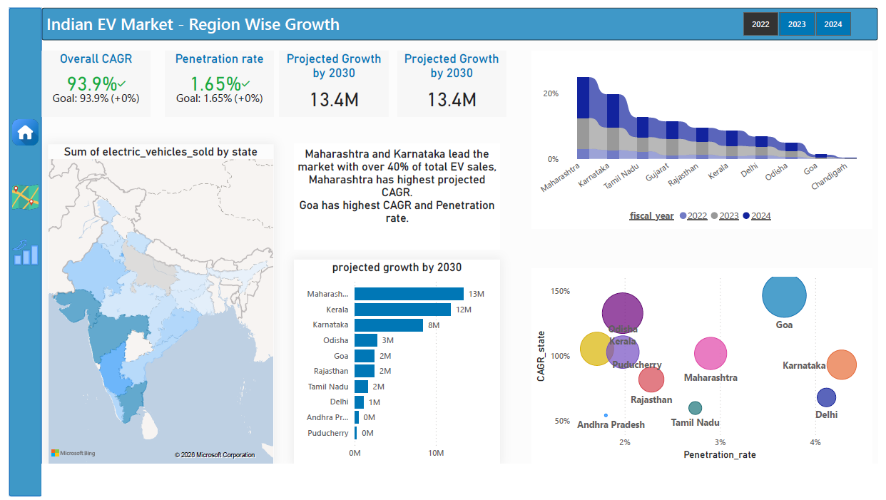
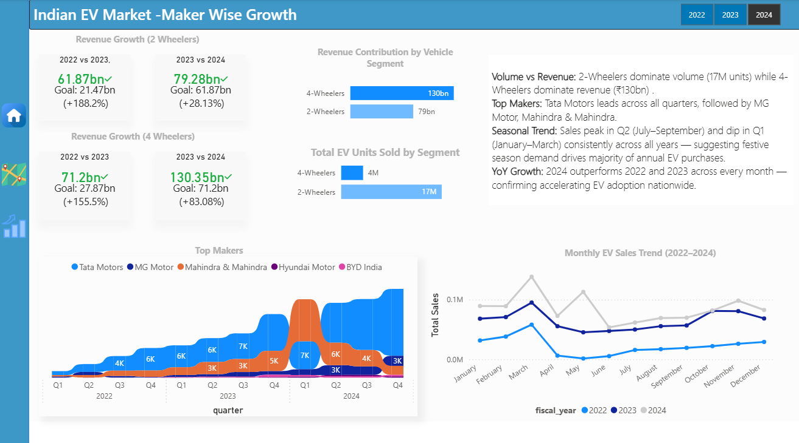

# ⚡ Indian EV Market Growth Analysis — Power BI Dashboard

> An end-to-end Power BI dashboard analysing India's Electric Vehicle market across regions, vehicle segments, and manufacturers from 2022 to 2024 — with projected growth forecasts up to 2030.

[](https://powerbi.microsoft.com/)
[]()
[]()

---

## 📁 Quick Access

| Resource | Link |
|----------|------|
| 📄 Full Dashboard PDF | [View PDF](./Indian_EV_Market_Growth_Analysis.pdf) |

---

## 🏢 Project Background

India's EV market is one of the fastest-growing in the world, driven by government policy (FAME II), rising fuel prices, and growing environmental awareness. This dashboard analyses state-wise EV adoption, revenue growth by vehicle segment, top manufacturers, and projects market size up to 2030.

The goal was to build a multi-page Power BI dashboard that gives policymakers, investors, and business analysts a clear picture of where India's EV market is growing — and where the biggest opportunities lie.

---

## 🎯 Objective

- Track EV sales and revenue growth YoY across 2022, 2023, and 2024
- Identify top performing states by volume, CAGR, and penetration rate
- Compare 2-Wheeler vs 4-Wheeler segments by revenue and volume
- Analyse top manufacturers and their quarterly sales trends
- Project state-wise EV growth up to 2030

---

## 🛠️ Tools & Technologies

| Tool | Purpose |
|------|---------|
| **Power BI Desktop** | Dashboard design, data modelling, report building |
| **DAX** | KPI measures — CAGR, Penetration Rate, YoY Growth, Projected Growth |
| **Power Query** | Data cleaning and transformation |
| **Bing Maps** | State-wise geographic visualisation |

---

---

## 📋 Dashboard Pages — Detailed Walkthrough

---

### 🗺️ Page 1: Region Wise Growth



**Purpose:** Show which Indian states are leading EV adoption — by volume, growth rate, penetration, and future potential.

**Visuals on this page:**

| Visual | What it shows |
|--------|--------------|
| **KPI Cards** | Overall CAGR (93.9%), Penetration Rate (1.65%), Projected Growth by 2030 (13.4M units) |
| **India Choropleth Map** | State-wise EV sales volume — darker = higher sales |
| **Projected Growth Bar Chart** | Top 10 states by projected EV units by 2030 — Maharashtra (13M), Kerala (12M), Karnataka (8M) lead |
| **CAGR % Bar Chart** | State-wise CAGR comparison across 2022–2024 — Goa and Kerala top the growth rate chart |
| **Scatter Plot** | CAGR_state (y-axis) vs Penetration Rate (x-axis) — bubble size = EV volume. Goa stands out with highest penetration + high CAGR |

**DAX measures powering this page:**
`Overall CAGR` · `Penetration Rate` · `Projected Growth 2030` · `CAGR_state`

**Key Insights:**
> **Maharashtra and Karnataka** lead total EV sales — together accounting for over 40% of national volume.

> **Goa** has the highest CAGR and penetration rate despite lower absolute volume — making it the most EV-mature market per capita.

> **Maharashtra** has the highest projected growth by 2030 at 13M units — driven by strong infrastructure and policy support.

> **Kerala and Karnataka** follow closely at 12M and 8M projected units respectively.

---

### 🚗 Page 2: Makers & Segment Analysis



**Purpose:** Analyse revenue performance by vehicle segment, identify top manufacturers, and track monthly and quarterly sales trends.

**Visuals on this page:**

| Visual | What it shows |
|--------|--------------|
| **2-Wheeler Revenue KPIs** | ₹61.87bn (2022–23, +188.2% vs goal) → ₹79.28bn (2023–24, +28.13% vs goal) |
| **4-Wheeler Revenue KPIs** | ₹71.2bn (2022–23, +155.5% vs goal) → ₹130.35bn (2023–24, +83.08% vs goal) |
| **Top Makers Area Chart** | Quarterly sales by manufacturer (Tata Motors, MG Motor, Mahindra & Mahindra, Hyundai Motor, BYD India) from Q1 2022 to Q4 2024 |
| **Revenue by Segment Bar** | 4-Wheelers: ₹130bn vs 2-Wheelers: ₹79bn |
| **Volume by Segment Bar** | 2-Wheelers: 17M units vs 4-Wheelers: 4M units |
| **Monthly Sales Trend Line** | Month-by-month sales comparison across 2022, 2023, 2024 |

**DAX measures powering this page:**
`YoY Revenue Growth %` · `Revenue vs Goal %` · `Total Units Sold` · `Revenue by Segment`

**Key Insights:**
> **2-Wheeler Revenue** grew from ₹61.87bn → ₹79.28bn (+28.13% YoY) — exceeding targets both years.

> **4-Wheeler Revenue** saw explosive growth: ₹71.2bn → ₹130.35bn (+83.08% YoY) — the strongest performing segment.

> **Tata Motors dominates** across all 12 quarters from 2022–2024, with MG Motor and Mahindra & Mahindra as distant second and third.

> **Volume vs Revenue paradox:** 2-Wheelers sell 17M units vs 4-Wheelers' 4M — but 4-Wheelers generate ₹130bn vs ₹79bn. Two completely different market dynamics.

> **Seasonal trend:** Sales consistently peak in Q2 (July–September, festive season) and dip in Q1 (January–March) across all three years — a reliable annual pattern for inventory planning.

> **2024 outperforms every prior year** across all months — confirming sustained, accelerating EV adoption nationwide.

---

## 💡 Top Business Insights Summary

| # | Insight | Signal |
|---|---------|--------|
| 1 | Overall EV CAGR of 93.9% — market nearly doubling every year | 🟢 Explosive growth |
| 2 | Maharashtra & Karnataka = 40%+ of national EV sales | 🟢 Geographic concentration |
| 3 | Goa leads in penetration rate & CAGR — most EV-mature state | 🟡 Policy benchmark |
| 4 | 4-Wheeler revenue (+83% YoY) growing faster than 2-Wheelers | 🟢 Premium segment rising |
| 5 | Tata Motors dominates — but MG & Mahindra gaining ground | 🟡 Watch competitive gap |
| 6 | Festive season (Q2) drives peak demand every year | 🟡 Seasonal planning opportunity |
| 7 | Projected 13.4M units nationally by 2030 | 🟢 Massive market ahead |

---

## 📂 Repository Structure

```
📦 Indian-EV-Market-Analysis
 ┣ 📄 README.md
 ┣ 📄 Indian_EV_Market_Growth_Analysis.pdf
 ┗ 📁 screenshots
    ┣ 🖼️ region_wise_growth.png
    ┗ 🖼️ makers_view.png
```

---

## 👩‍💻 About Me

Aspiring Data Analyst passionate about turning raw data into business decisions. Skilled in Power BI, SQL, DAX, Python, and data storytelling.

📧 *nupursrivastava94@gmail.com*
🔗 *www.linkedin.com/in/nupur-srivastava-5456131a3*
🐙 https://github.com/Nupur-DS

---

*Dataset sourced from publicly available Indian EV market data. Built as a self-initiated portfolio project.*
